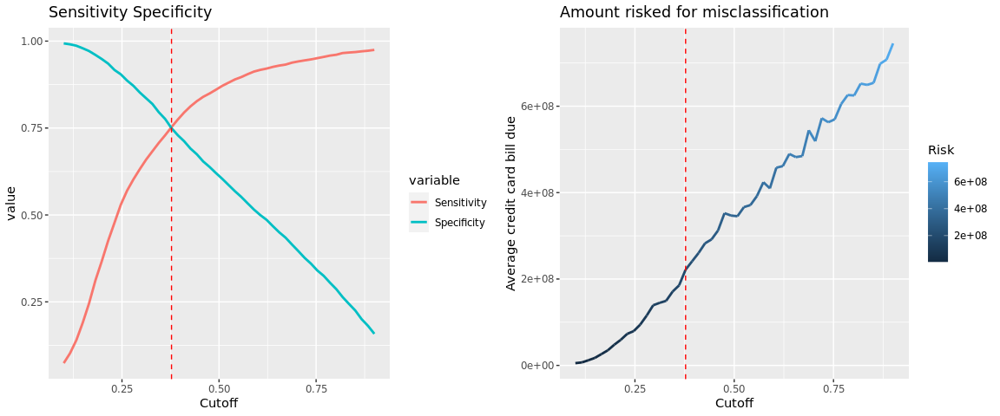
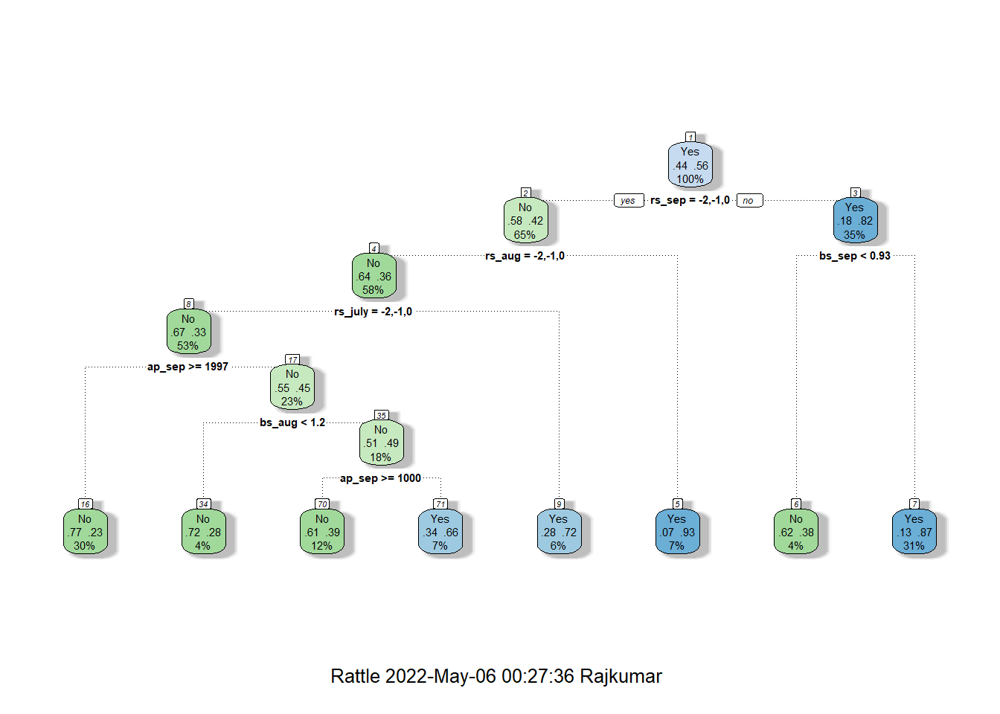

# Credit Card Default Analysis and Prediction  

## Full Report
Access here https://rajkumarcm.github.io/CreditCardDefault/

## Introduction  

This repository contains implementation of "Credit Card Default Analysis and Prediction" using R Programming language. 

I am sure you have often come across headlines such as financial crisis caused by Credit Card Debt, and I thought this topic would be ideal for the Data Science project.  

Some of the core objectives of this project would be to:  
1. Find the demographic pattern in those who default.  
2. Find the repayment pattern found in those who default.  
3. Using statistical model, find measures that can be taken to mitigate the risks of insolvency.  

## Dataset
Data for this project was fetched from UCI Machine Learning Repository[1] and it contains 30000 instances and 24 attributes.

## EDA  Results
Before EDA, SMOTE was applied to bring the data to a reasonable balance.
1. 

## Modeling  
### GLM    
The following figure depicts the robustness of the model and the risk involved in choosing the cutoff threshold. Given this is a binary classification problem - default or do not default, the cutoff threshold plays an important role in deciding the robustness of the logit model fitted.  
  
  
  
  
### Decision Tree  
  
  
#### Rules  
Prefix rs, bs, and ap represent repayment status, bill statement, and amount paid respectively.  
  
## References
1. UCI Machine Learning Repository https://archive-beta.ics.uci.edu/dataset/350/default+of+credit+card+clients
